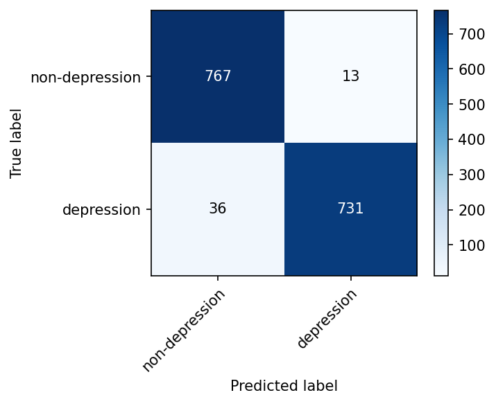
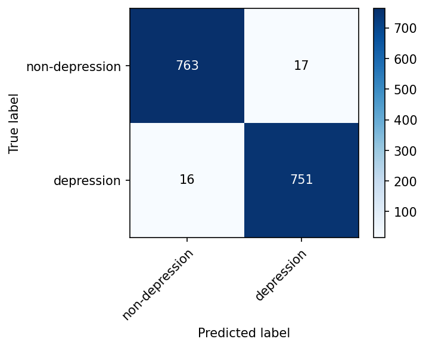

# Mental Health Text Classification
---

## Purpose and objectives

The main objective of this project is to **compare a classical ML approach** (TF-IDF + Logistic Regression) and a **deep learning approach** (fine-tuned BERT) for **binary text classification**: distinguishing depression-related vs non-depression posts (e.g. from Reddit or similar social media)!

- **Why it matters:** It tests whether a simple, interpretable baseline is “good enough” or whether a more complex model (BERT) is worth the extra cost for this kind of mental-health text.
- **Deliverables:** Reproducible training and evaluation (same 80/20 stratified split, same metrics), saved metrics, confusion matrices for both models, and a comparison table so you can justify model choice for downstream or larger systems.

---

## Project overview

This repository implements two approaches to classifying short text as indicative of depression (1) or not (0):

- **Model 1 (Baseline):** Preprocessed text (lowercase, punctuation removed), TF-IDF vectorisation, and a Logistic Regression classifier. Trained and evaluated with an 80/20 stratified train/test split.
- **Model 2 (Deep learning):** Fine-tuned **bert-base-uncased** (HuggingFace) for sequence classification using the same split. Training uses AdamW and 2–3 epochs.

Both models are evaluated on accuracy, precision, recall, F1-score, and a classification report. The baseline also produces a confusion matrix plot. Results are saved to the `results/` folder and a Markdown comparison table is generated.

---

## Dataset description

- **Columns:** `text` (string), `label` (integer).
- **Labels:** `0` = non-depression, `1` = depression.
- **Location:** Place your CSV at `data/dataset.csv`. The dataset is not included in this repository (e.g. for privacy or size); add your own file before running the scripts.
- **Expected format:** UTF-8 CSV with headers `text` and `label`. Rows with missing `text` or `label` are dropped.

**Getting a dataset:** To run the pipeline without your own data, you can generate a small sample (900 rows) with `python scripts/generate_sample_data.py`. For real research, use a proper labelled corpus or try the optional download script: `python scripts/download_dataset.py` (requires `datasets`) to fetch the Reddit depression dataset from HuggingFace and save it as `data/dataset.csv`.

---

## Methodology

### Baseline (TF-IDF + Logistic Regression)

1. **Preprocessing:** Text is lowercased and punctuation is removed; extra whitespace is collapsed.
2. **Vectorisation:** TF-IDF with a capped vocabulary (e.g. 15k features), optional bigrams, and sublinear TF.
3. **Classifier:** Logistic Regression (L2, balanced class weights) with a fixed random state for reproducibility.
4. **Split:** 80% train / 20% test, stratified by `label`, with `random_state=42`.

### BERT (Deep learning)

1. **Model:** HuggingFace `bert-base-uncased` with a sequence classification head (2 labels).
2. **Tokenisation:** `AutoTokenizer` with truncation and a max length (e.g. 256).
3. **Training:** 2–3 epochs, AdamW optimizer (e.g. lr=2e-5), linear schedule. Batch size 16 (configurable).
4. **Split:** Same 80/20 stratified split as the baseline (`random_state=42`) for a fair comparison.

---

## Evaluation metrics

- **Accuracy:** Proportion of correct predictions. Can be misleading if classes are imbalanced.
- **Precision:** Among predicted positives, how many are truly positive. Important when false positives are costly.
- **Recall:** Among true positives, how many are predicted positive. Important for screening (catching at-risk cases).
- **F1-score:** Harmonic mean of precision and recall; balances the two for binary classification.
- **Confusion matrix:** Counts of true/false positives and negatives; used for the baseline plot and for interpreting trade-offs.

For mental health text, class imbalance is common, so precision, recall, and F1 (and the full classification report) are more informative than accuracy alone.

---

## Installation and usage
Requirements:
- Python 3.8+

Install dependencies: 
- pip install -r requirements.txt
Running the models

Baseline only:
python run_baseline.py
Writes results/baseline_metrics.txt and results/confusion_matrix_baseline.png.

BERT only:
python run_bert.py
Writes results/bert_metrics.txt.

Both + comparison table:
python run_all.py
Runs baseline and BERT, writes both metric files and the confusion matrix plot, then generates results/comparison_table.md.

Optional arguments (all scripts):
--data PATH — path to CSV (default: data/dataset.csv).
--results-dir DIR — output directory (default: results).
F
or BERT / run_all:
--epochs N — number of BERT training epochs (default: 3).

---

## Results

Results below are from training and evaluating both models on the **Reddit depression cleaned dataset** (7,731 rows; 80% train / 20% test, stratified).

### Model comparison (test set)

| Metric | Baseline (LR + TF-IDF) | BERT |
| --- | --- | --- |
| Accuracy | 0.9683 | 0.9787 |
| Precision | 0.9825 | 0.9779 |
| Recall | 0.9531 | 0.9791 |
| F1-score | 0.9676 | 0.9785 |

### Confusion matrices

| Baseline (TF-IDF + LR) | BERT |
| --- | --- |
|  |  |

### Output files

- `results/baseline_metrics.txt` — baseline metrics and classification report.
- `results/bert_metrics.txt` — BERT metrics and classification report.
- `results/confusion_matrix_baseline.png` — baseline confusion matrix.
- `results/confusion_matrix_bert.png` — BERT confusion matrix.
- `results/comparison_table.md` — Markdown table (same as above).

---

## Findings and interpretation

**What the results show**

- Both models perform well on the Reddit depression dataset (~97–98% accuracy, F1), so **automated classification of depression-related text is feasible** with either approach.
- BERT is slightly better on the reported metrics (e.g. accuracy 0.9787 vs 0.9683, F1 0.9785 vs 0.9676), with somewhat higher recall, so it catches a few more true positives (depression cases) for similar precision.
- Confusion matrices show that both models make most errors at the boundary (some false positives and false negatives), with BERT having slightly fewer.

**Why the baseline and BERT differ**

- **Baseline (TF-IDF + Logistic Regression)** uses a **bag-of-words** representation (TF-IDF): word (and n-gram) counts, with no word order or context. It is good at **lexical cues** (e.g. “hopeless”, “can’t get out of bed”) but can miss **context** (e.g. “I used to feel hopeless” vs “I no longer feel hopeless”). It is fast, interpretable (e.g. via coefficients), and works with moderate data.
- **BERT** uses **contextual embeddings** and **attention** over the full sequence, so it can use **word order and context** and subtle phrasing. It is better at **nuance and negation**, and can leverage pre-trained language knowledge. It has more parameters and is more data-hungry; it is slower and less interpretable.

So the **disparity** is: BERT’s small gain (on the order of ~1 percentage point on these metrics) comes from **better use of context and phrasing**, while the baseline is strong because **many depression-related posts contain clear lexical cues** that TF-IDF can already capture. The gap is modest, which suggests that for this dataset and task, **lexical signal is strong** and the added value of BERT is real but not large.

---

## Reflection

### Precision vs recall trade-offs

In mental health screening, **recall** matters when the goal is to avoid missing at-risk individuals (prioritise catching true positives). **Precision** matters when false positives could lead to unnecessary worry, stigma, or overload of services. The choice depends on the use case: a triage tool might favour recall; a research filter might favour precision. Adjusting the classification threshold shifts the precision–recall trade-off; the default 0.5 is not always optimal.

### Class imbalance

Depression-labelled data are often a minority. Without care, models can bias toward the majority class and still achieve high accuracy. This project uses **stratified** train/test splits and **balanced** class weights in the baseline to mitigate imbalance. Metrics such as F1 and the per-class precision/recall in the classification report are more informative than accuracy when classes are imbalanced.

### Ethical considerations

Automated mental health detection raises serious ethical issues: risk of **stigma**, **misuse** (e.g. surveillance), **over-reliance** on algorithms, and **lack of clinical validation**. Such systems should not replace human assessment. They may support research or triage only when used with clear governance, consent, and human-in-the-loop design, and should be validated in context rather than treated as standalone diagnostics.

### Model complexity vs performance

The **baseline** is fast, interpretable (e.g. via coefficients or feature importance), and works well with limited data. **BERT** can capture more context and nuance but requires more data and compute and is harder to interpret. The comparison table helps decide whether the performance gain from BERT justifies its complexity; on small or narrow-domain datasets, the baseline can be competitive or preferable.

### Concerns about oversimplifications

Binary classification—labeling texts simply as “depression” or “non-depression”—is too simplistic because it ignores uncertainty and gradations of risk. In reality, mental health signals are subtle and vary over time. By moving to probabilistic outputs, the model can provide calibrated likelihoods (e.g., 70% chance of depression), allowing more nuanced assessment, earlier detection, and flexible thresholds for intervention. **Future work should focus on calibrating these probabilities so they accurately reflect real-world risk, rather than relying on a rigid yes/no decision.**


---

## Code structure

```
MentalAITrial/
├── data/                    # Place dataset.csv here
├── results/                 # Generated metrics and plots (created at run time)
├── src/
│   ├── __init__.py
│   ├── utils.py             # load_dataset, get_train_test_split, ensure_results_dir
│   ├── baseline_model.py    # Preprocess, TF-IDF, LR, evaluation, confusion plot
│   └── bert_model.py        # BERT fine-tuning and evaluation
├── run_baseline.py          # Train and evaluate baseline only
├── run_bert.py              # Train and evaluate BERT only
├── run_all.py               # Run both and generate comparison table
├── requirements.txt
└── README.md
```

Reproducibility is ensured by a fixed `random_state=42` for the train/test split and for any randomness in the baseline; the BERT script uses matching seeds for numpy and PyTorch.
